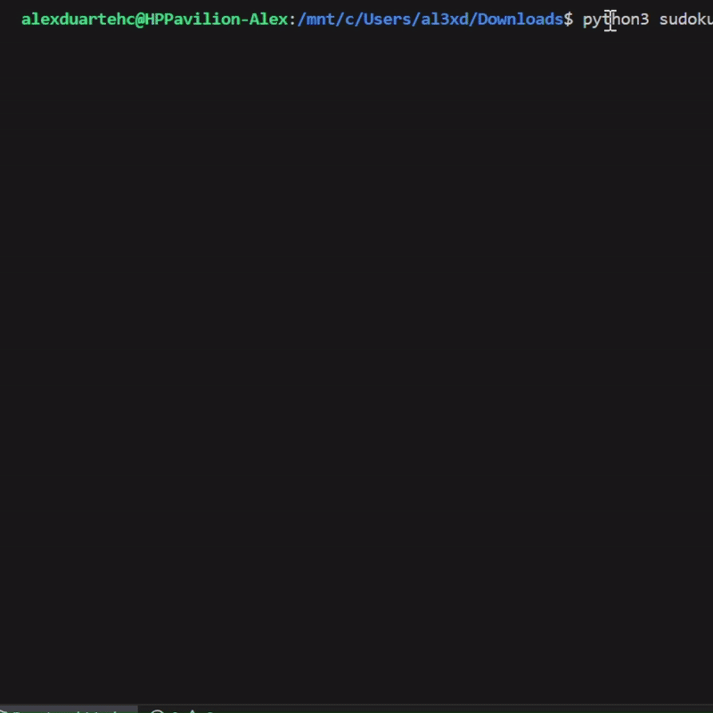

# Sudoku Solver
This repository contains a Python program that solves Sudoku puzzles using a backtracking algorithm. It's a classic example of recursion and constraint satisfaction problems in computer science.

Solves any valid 9x9 Sudoku puzzle

Clear and readable implementation in Python

Visual output of the solved puzzle in the console

Easily customizable for different inputs and tables of any size

## Backtracking Algorithm:

(1) Find the first empty cell.

(2) Try digits 1–9 in that cell.

(3) If the number is valid (not in the same row, column, or 3x3 box), recurse.

(4) If a number leads to no solution later, backtrack and try the next.

(5) Repeat until the board is complete or determined unsolvable.

### Demo

## Disclaimer
Feel free to modify the solutions and create your own implementations of each applied exercise.
